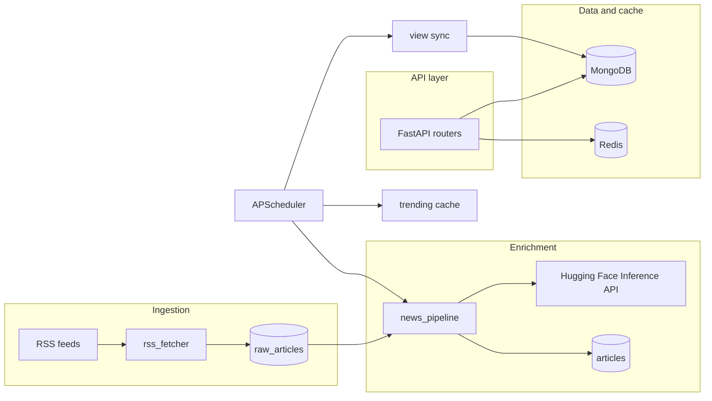

# IntelliNews — Architecture

This document describes the **IntelliNews** backend from an architecture perspective: how the system is structured, why key decisions were made, how data and AI flow through it, and how the HTTP API is organized.

---

## 1. What this project is

A **Python [FastAPI](https://fastapi.tiangolo.com/)** service that:

- **Ingests** news from RSS feeds  
- **Enriches** articles with AI (summaries, sentiment, categories) via the **Hugging Face Inference API**  
- **Persists** data in **MongoDB** (Motor async driver)  
- **Caches** and buffers high-churn data in **Redis**  
- Exposes a **REST API** for authentication, feeds, comments, bookmarks, analytics, vocabulary practice, and community clubs  
- Runs **scheduled jobs** (APScheduler) for ingestion, trending, and view synchronization  

The codebase is a **modular monolith**: one deployable app with clear boundaries between routes, persistence, services, and utilities.

---

## 2. High-level architecture

**Request path:** HTTP clients hit **routers** under `app/routes/`. Handlers use **Motor** collections from `app/db/` and, where applicable, **Redis** helpers. Most read paths do **not** call Hugging Face; they read **precomputed** fields on `articles`.

**Why:** Keeping AI on the **ingestion path** avoids unpredictable latency and quota spikes on every article read, and keeps the API easier to scale horizontally (stateless app + shared DB/cache).

---

## 3. Application lifecycle

Defined in `app/main.py` with FastAPI **lifespan**:

1. **Connect MongoDB** — creates indexes on collections (e.g. `articles.created_at`, `articles.category`, text index on title/content, unique indexes for users and `raw_articles.url`, club `slug`, etc.).  
2. **Connect Redis** — failures are caught so the app can still run without cache.  
3. **Seed clubs** — predefined club documents if missing.  
4. **Start scheduler** — periodic news pipeline, trending refresh, view sync.  
5. On shutdown: stop scheduler, close MongoDB and Redis.

---

## 4. Core design choices

### 4.1 Two-stage article lifecycle

| Stage | Collection | Purpose |
|--------|------------|---------|
| Ingest | `raw_articles` | Parsed RSS rows with `is_processed`; unique `url`. |
| Serve | `articles` | Enriched documents: summary, sentiment, category, tags, locations, engagement counters, breaking flag, etc. |

**Why:** Decouples **fast, idempotent fetching** from **slow, fallible AI**. Retries and backfills can target unprocessed raw rows without re-hitting every feed.

### 4.2 AI at write time, not read time

`app/services/news_pipeline.py` → `process_article()` calls:

- `summarize_text()`  
- `analyze_sentiment()` (on the summary)  
- `classify_text()` with labels derived from `CATEGORIES` in `app/utils/helpers.py`  
- Heuristics for tags, locations, reading time, and breaking-news signals  

Results are written to `articles` before clients request them.

### 4.3 Graceful degradation (Hugging Face)

Implemented in `app/services/summarizer.py` and helpers:

- **No API key:** summarization falls back to a **truncated** excerpt; classification falls back to **`categorize_article()`**; sentiment can use **`_keyword_sentiment()`** when HF is unavailable or fails.  
- **HTTP errors / timeouts:** similar fallbacks where coded.

**Why:** Local development, quota limits, and cold models should not brick ingestion or reads.

### 4.4 Redis: caching and view buffering

- **Trending:** aggregation over recent articles, score from views, upvotes, and comment counts; results **cached** (see `app/routes/analytics.py` and `cache_set` / `cache_get` in `app/db/__init__.py`).  
- **Views:** `record_view_in_redis()` debounces by article + IP, accumulates counts in Redis, then `sync_views_to_mongodb()` batches **`$inc`** into MongoDB on a schedule.

**Why:** High write rates for impressions should not synchronously hammer MongoDB on every request.

### 4.5 Personalization (rule-based)

`GET /article/personalized` filters by the user’s **`news_preferences`** (enabled categories), fetches recent candidates, then surfaces **breaking** items first.

**Why:** Explainable, cheap, and sufficient for a preference-driven feed without training a separate ranking model.

### 4.6 Background jobs

`app/scheduler.py` (APScheduler + asyncio):

- **News pipeline** — interval from settings (also runs once as a task on startup).  
- **Trending** — periodic refresh (cached aggregates).  
- **View sync** — pushes debounced Redis view counts into MongoDB.

Admins can also trigger pipeline and breaking-news maintenance via **`/admin`** routes.

### 4.7 Authentication and authorization

- **JWT** access and refresh tokens (`app/utils/security.py`).  
- **`HTTPBearer`** dependencies: `get_current_user_required`, `get_current_user_optional`, `require_admin` (`app/dependencies.py`).  

### 4.8 CORS

`CORSMiddleware` allows **`allow_origins=["*"]`** in `app/main.py` — convenient for development; production deployments should restrict origins.

---

## 5. News and AI pipeline (how it works)

### 5.1 RSS ingestion

`app/services/rss_fetcher.py`:

- Fetches feed URLs with **aiohttp**.  
- Parses with **feedparser**.  
- Strips HTML / normalizes text (**BeautifulSoup** / `clean_html` in helpers).  
- Optionally attaches **`rss_location`** per configured feed region.  
- Upserts into **`raw_articles`** with `is_processed: false`.

### 5.2 Pipeline execution

`app/services/news_pipeline.py` → `run_pipeline()`:

1. Demote **`is_breaking`** for articles older than 24 hours.  
2. `fetch_and_store_feeds()`.  
3. Load unprocessed raw articles (bounded batch).  
4. For each item: **duplicate** guard (same title recently), else `process_article()`, upsert **`articles`** by `url`, mark raw row processed.

### 5.3 Enrichment details

- **Summary:** Hugging Face summarization model (default `facebook/bart-large-cnn`, configurable via env).  
- **Sentiment:** HF sentiment model (default DistilBERT SST-style) with lexicon fallback.  
- **Category:** HF zero-shot / NLI-style classification against **`CATEGORIES` keys**; on failure, **`categorize_article()`** keyword scoring.  
- **Tags:** `extract_tags_from_text()` (frequency over non-stopwords).  
- **Locations:** `extract_locations_from_text()` plus optional **`rss_location`**.  
- **Reading time:** `estimate_reading_time()` from word count.  
- **Breaking:** source + title heuristics; admin endpoint can widen matches by regex.

**Why sentiment on the summary:** Shorter text reduces cost and latency while staying aligned with the same compressed story representation used for display.

### 5.4 Configuration

`app/config.py` loads environment variables (see also project `README.md`), including:

- `MONGODB_URL`, `MONGODB_DATABASE`  
- `REDIS_URL`  
- `HUGGINGFACE_API_KEY`, `HUGGINGFACE_MODEL`, `HUGGINGFACE_SENTIMENT_MODEL`, `HUGGINGFACE_CLASSIFICATION_MODEL`  
- RSS intervals and per-fetch caps  

---

## 6. How AI is integrated

| Concern | Location | Behavior |
|--------|----------|----------|
| HTTP client | `app/services/summarizer.py` | `aiohttp` POST to `https://api-inference.huggingface.co/models/<model>`. |
| Auth | Same | `Authorization: Bearer <HUGGINGFACE_API_KEY>`. |
| Summarization | `summarize_text()` | Truncated input, `wait_for_model`, post-processing for multi-sentence bullet layout. |
| Sentiment | `analyze_sentiment()` / `_hf_sentiment()` | Maps model labels to `positive` / `neutral` / `negative`; fallback lexicon. |
| Classification | `classify_text()` | `candidate_labels` from app categories; fallback `categorize_article()`. |

**Not powered by HF in this codebase:** JWT auth, club posts, bookmarks, most analytics aggregations, vocabulary cards (user-stored learning data).

---

## 7. Data model (MongoDB)

Collections accessed via `app/db/__init__.py`:

| Collection | Typical contents |
|------------|------------------|
| `articles` | Enriched stories, engagement fields, indexes for list/filter/search. |
| `raw_articles` | Raw RSS rows, `is_processed`, unique `url`. |
| `users` | Credentials hash, profile, `news_preferences`, gamification, bookmarks, vocab, joined clubs, push subscriptions. |
| `comments` | Threaded comments on articles; ties to `comments_count` on articles. |
| `user_interactions` | Append-only log (views, votes, shares) for analytics. |
| `clubs` | Club metadata (seeded at startup). |
| `club_posts` | Club feed posts (text and/or embedded shared article). |
| `club_comments` | Threaded comments on club posts. |

---

## 8. HTTP API surface

Routers are mounted in `app/main.py`. Base URL in local docs is typically `http://localhost:8000`. **OpenAPI** is served at **`/docs`** when the app runs.

### 8.1 Health

| Method | Path | Notes |
|--------|------|--------|
| GET | `/` | Basic health JSON. |
| GET | `/health` | Health payload (strings mention DB/cache). |

### 8.2 Authentication — `/auth`

| Method | Path | Notes |
|--------|------|--------|
| POST | `/auth/register` | Creates user; returns tokens. |
| POST | `/auth/login` | Body: `identifier` (email **or** username) + `password`. |
| POST | `/auth/refresh` | Refresh token → new tokens. |
| GET | `/auth/me` | Current user profile. **Bearer required.** |
| PUT | `/auth/me` | Update profile. **Bearer required.** |
| POST | `/auth/logout` | **Bearer required.** |
| POST | `/auth/push/subscribe` | **Bearer required.** |
| DELETE | `/auth/push/unsubscribe` | **Bearer required.** |
| GET | `/auth/me/stats` | Gamification / badges. **Bearer required.** |

Protected routes: header `Authorization: Bearer <access_token>`.

### 8.3 Articles — `/article`

| Method | Path | Notes |
|--------|------|--------|
| GET | `/article/` | Cursor pagination, filters: category, tag, location, breaking, `sort_by`, `date_filter`. |
| GET | `/article/personalized` | Preference-based feed. **Bearer required.** |
| GET | `/article/{article_id}` | Full article; optional user updates history/gamification. |
| POST | `/article/{article_id}/upvote` | **Bearer required.** |
| POST | `/article/{article_id}/downvote` | **Bearer required.** |
| POST | `/article/{article_id}/share` | **Bearer required.** |
| POST | `/article/{article_id}/view` | Records debounced view in Redis. |

### 8.4 Comments — `/comments`

| Method | Path | Notes |
|--------|------|--------|
| POST | `/comments/` | Create comment. **Bearer required.** |
| GET | `/comments/{article_id}` | List comments for article. |
| DELETE | `/comments/{comment_id}` | Own comment or admin. **Bearer required.** |
| POST | `/comments/{comment_id}/upvote` | **Bearer required.** |
| POST | `/comments/{comment_id}/downvote` | **Bearer required.** |

### 8.5 Bookmarks — `/bookmarks`

| Method | Path | Notes |
|--------|------|--------|
| GET | `/bookmarks/` | **Bearer required.** |
| POST | `/bookmarks/{article_id}` | **Bearer required.** |
| DELETE | `/bookmarks/{article_id}` | **Bearer required.** |

### 8.6 Admin — `/admin`

| Method | Path | Notes |
|--------|------|--------|
| POST | `/admin/refresh` | Run news pipeline. **Admin only.** |
| POST | `/admin/refresh-breaking` | Refresh breaking flags. **Admin only.** |
| GET | `/admin/stats` | Counts. **Admin only.** |

### 8.7 Analytics — `/analytics`

| Method | Path | Notes |
|--------|------|--------|
| GET | `/analytics/trending` | Trending articles (cached). |
| GET | `/analytics/top-categories` | Aggregated category stats. |
| GET | `/analytics/daily-counts` | Articles per day. |
| GET | `/analytics/reading-insights` | **Bearer required.** |
| GET | `/analytics/dashboard` | **Bearer required.** |

### 8.8 Vocabulary — `/vocab`

| Method | Path | Notes |
|--------|------|--------|
| GET | `/vocab/today` | **Bearer required.** |
| POST | `/vocab/practice/done` | **Bearer required.** |
| GET | `/vocab/progress` | **Bearer required.** |
| POST | `/vocab/add` | **Bearer required.** |

### 8.9 Clubs — `/clubs`

| Method | Path | Notes |
|--------|------|--------|
| GET | `/clubs/` | List clubs. |
| GET | `/clubs/{slug}` | Club detail. |
| POST | `/clubs/{slug}/join` | **Bearer required.** |
| POST | `/clubs/{slug}/leave` | **Bearer required.** |
| GET | `/clubs/{slug}/members` | Member list. |
| GET | `/clubs/{slug}/posts` | Paginated posts. |
| POST | `/clubs/{slug}/posts` | Create post (member). **Bearer required.** |
| POST | `/clubs/{slug}/posts/{post_id}/upvote` | **Bearer required.** |
| POST | `/clubs/{slug}/posts/{post_id}/downvote` | **Bearer required.** |
| GET | `/clubs/{slug}/posts/{post_id}/comments` | List comments. |
| POST | `/clubs/{slug}/posts/{post_id}/comments` | **Bearer required.** |

### 8.10 Documentation drift

The repository may contain **`api.md`** or other notes that do not match every live route (for example, a documented “similar articles” endpoint may not exist in `app/routes/articles.py`). **`/docs`** and the router modules under `app/routes/` are the source of truth.

---

## 9. Tradeoffs summary

| Decision | Rationale |
|----------|-----------|
| MongoDB documents | Flexible schema for RSS-shaped articles and nested user/club data. |
| Raw + processed collections | Retry enrichment without full re-fetch; clear pipeline boundary. |
| Hugging Face Inference API | No self-hosted GPU cluster; swap models via configuration. |
| Redis for views + batch sync | Protect MongoDB from per-impression writes while keeping counts useful. |
| Cached trending | Reduce repeated aggregation load. |
| Rule-based personalization | Low complexity; uses pipeline outputs and explicit user prefs. |
| Heuristic breaking news | Cheap signal without a dedicated breaking-news model. |

---

## 10. Related files (quick map)

| Area | Path |
|------|------|
| App entry, lifespan, router mounts | `app/main.py` |
| Settings | `app/config.py` |
| MongoDB / Redis helpers | `app/db/__init__.py` |
| Auth dependencies | `app/dependencies.py` |
| RSS fetch | `app/services/rss_fetcher.py` |
| Pipeline + `process_article` | `app/services/news_pipeline.py` |
| HF summarization / sentiment / classification | `app/services/summarizer.py` |
| Categories + text helpers | `app/utils/helpers.py` |
| Jobs | `app/scheduler.py` |
| HTTP routes | `app/routes/*.py` |

---

*Last aligned with the codebase layout and behavior as documented here; regenerate or amend this file when major structural or API changes land.*
